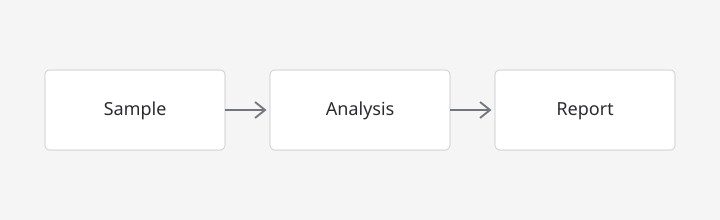

# Rich Markdown Preview Showcase

This document demonstrates the Markdown features available in Lab Workspace's **offline rich preview**.

> All calculations and scientific content here are illustrative only.

---

## Text, links, and lists

Use **bold**, *italic*, ~~strikethrough~~, and automatic links such as https://www.qt.io.

You can also write a named link: [Qt documentation](https://doc.qt.io/).

- An unordered item
  - A nested item
  - Another nested item
- A final item

1. An ordered item
2. Another ordered item

### Task list

- [x] Add a material record
- [x] Calculate a reaction
- [ ] Review the result
- [ ] Export the final report

## Local image

The preview resolves a relative image path from this Markdown file's folder:



## Table

| Material | Formula | Amount | Status |
| --- | --- | ---: | --- |
| Water | H₂O | 10 mL | Ready |
| Sodium chloride | NaCl | 2.50 g | Ready |
| Sample A | — | 1 vial | Pending |

## Math with KaTeX

Inline math: $c = \lambda\nu$.

Display math:

$$
PV = nRT
$$

And a sample concentration calculation:

$$
C = \frac{n}{V} = \frac{0.250\ \mathrm{mol}}{0.500\ \mathrm{L}} = 0.500\ \mathrm{mol\,L^{-1}}
$$

## Syntax-highlighted code

```python
from math import pi

radius_cm = 2.5
area_cm2 = pi * radius_cm ** 2
print(f"Area: {area_cm2:.2f} cm²")
```

```json
{
  "sample": "SMP-2026-0001",
  "method": "DENSITY",
  "status": "completed"
}
```

## Mermaid diagram


## Raw HTML safety

Raw HTML is intentionally displayed as text rather than executed. To document HTML, put it in a code block:

```html
<strong>This is documentation, not live preview HTML.</strong>
```
